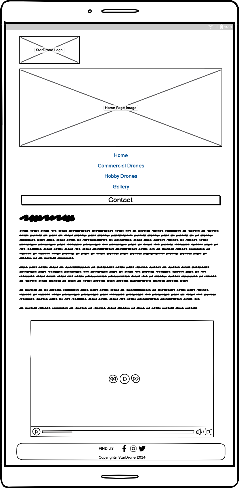
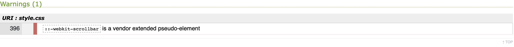
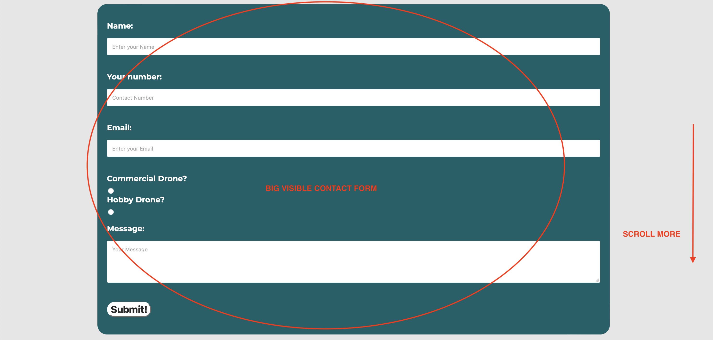

# Table of content

### Project Goals
- User Goals
- Site Owner Goals

### User Experience
- Target Audience
- User Requirements and Expectations
- User Stories

### Design
- Design Choices
- Colour
- Fonts
- Structure
- Wireframes

### Technologies Used
- Languages
- Framework and Tools

### Features

### Testing
- HTML Validation
- CSS Validation
- Accessibility
- Performance
- Device testing
- Browser compatibility

### Future Features
### Deployment
### Bugs
### Code
### Acknowledgements

# Project Goals

### User Goals
- Customer to find a information about variety of drones they are interested.
- Finding information about types of drone.
- Find nearest location (parking where the store is located).
- Find Gallery with additional drone images.
- Contact form to get more informations about the drone.

### Site Owner Goals
- Increase number of customers.
- Promote the business in a professional fashion.
- Provide essential information about the business to customers.
- Capture new customers by providing up to date list of current drone market with quick look up into pricing and features. 

# User Experience
### Target Audience
- People looking for place to find expertise about the drones.
- People with specific requirements regarding their drone needs.
- Companies that would like to purchase their drone to profide new kind of service for their customers.

### User Requirements and Expectations
- A simple and intuitive navigation system.
- Quickly and easily fond relevant information.
- Links and functions that work as expected.
- Good presentation and visually appealing design regardless of screen size.
- An easy way to connect the busienss .
- Accessibility
- Videos of drone footage / pictures of different types of drones. 
- Links to social media open on new tab.

### User Stories

#### First-time User
- As a first time user, I want to know where the store is located.
- As a first time user, I want to know the prices.
- As a first time user, I want to know more about types of drones.
- As a first time user, I want to know more about uses of a drone.
- As a first time user, I want to see actual footage from the drone.
- As a first time user, I want to see video footage.

#### Returning User
- As a returning user, I want to see the location.
- As a returning user, I want to easily contact the shop.
- As a returning user, I want to find the drone shop on social media.

#### Site Owner
- As the site owner, I want to be able considerable cut admin time spent giving out basic information that you can now find on the website.
- As the site owner, I want users to know the drone shop and trust us with our expertise.
- As the site owner, I want the users to be able to contact us.
- As the site owner, I want to capture new busness with the contact form and store data safely.
- As the site owner, I want the users to be able to see how the actual images from the drone may look like.
- As the site owner, I want the users to find our location.

# Design

### Design Choices
The webpage was designed to evoke the feeling of professionalism, and as well as trust about the service provided. Navigation is simple and intuitive. The photos show different kind of drones in action. The video show first person view of drone druing the flight. 

### Colour
The colour scheme was choosen for its good contrast and for modern appeal. The colors also matchiong company logo. AI color generator, <https://looka.com/logo-maker/> which inspired the color palette that I finally landed on.

### Fonts
Montserrat with sans saris as a fallback was used for the body of entire website. Font weight 400. 

### Structure
The structure of the page is build in a recognisable and intuitive format. Upon arriving to the werbsite user sees a familiar type of a drone in motion. Stardrone name and logo above it.
Below the image is located navigation bar that contain five easly visible and recognisable pages.

- A home page with informations about Stardrone and why customer suppose to trust us, as well as video presenting first person view of a drone mid flight.
- Commercial drone page where the commercial customer niche can see opportunities to grow their business by choosing right drone for the type of business they are commercing.
- Hobby drone page where every day parson without specialised needs such as hobbyost can find great drone for them.
- Gallery page where all of the users may enjoy some actual images captured from the drone. Those are actual images from my drone during my Snowdon hike.
- Contact page with additional convincing text why customer should choose us. The contact us form right underneth, as well as map to the nearest free parking next to our store.

### Wireframes

1. Home
- Computer Screen
   

- Tablet Screen
  
  
- Cellphone Screen
  
   
2. Commercial
- Computer Screen
   

- Tablet Screen
  
  
- Cellphone Screen
  

3. Hobby
- Computer Screen
   

- Tablet Screen
  
  
- Cellphone Screen
  

4. Gallery
   - Computer Screen
   

- Tablet Screen
  
  
- Cellphone Screen
  

5. Contact
  - Computer Screen
   

- Tablet Screen
  
  
- Cellphone Screen
  

# Technologies Used

### Languages
- HTML
- CSS

### Frameworks and Tools
- Github
- Google Fonts
- Google Maps
- Looka.com
- Openai ChatGPT

# Features

### Logo and Navigation Bar
- Featured on all five pages
- Navbar is responsive and shrinking to smaller size as well as position for the bar changing from row to column.
- It allow users to navigate the page 
- Stays below main image
- Logo is clickable and it will re-direct user back to the home page when clicked.
- Logo stays in position on all screen sizes

### Main Image
- Introduces the user to the drone website with a large image. That adjusting itself on smaller screens. 
- Each and single page include large imagev depending on drone type that user would like to find informations. i.e. For commercial drone the image shows professional drone that can perform advanced tasks.
- Hobby page contain image with drone for less demanding customers.
- Contact page shows little drone presented above the hand that suppose to connect company to the customer.

### Video
- A short video found on YouTube with inspirational audio plays when clicked.
- Once finished, the customer can reply the video.
- Video of a flying drone and the view from its front camera.

### Footer
- Featured on all five pages
- Contain three separate logos to our social media all open in the new tab.

        --> Facebook 
        --> Instagram
        --> X

- Include copytights to StarDrone 2024
- Responsive design
- Stick to the bottom
- On smaller screens the footer position itself from row to column.

### Gallery
- Simple gallery code written in HTML and CSS
- Gallery containing 4 (four images)
- Images can be changed by the user by clicking on one of four bars visibly located on the image.

### Contact form
- Simple form for a user that require more informations about a drones, 
- Form include 3 fields for Name, Number, Email:
- 2 radio buttons regarding type of a drone they are looking foor.
- Message field to write a message with a specific question.
- Submit! button to submit a form.
- Responsive design.

### Google Map
- Large and easy to understand map of our approximate location. 
- Map is set to load from further distance to show nearest motorways and juctions as well as massive Birmingham Airport that customers may use as a direction on road traffic signs.
- Map include two buttons + and - to zoom in and out the map
- Possibility to open satelite view map 
- Possibility of mowing the map any direction.
- The map is responsive to all types of devices.

# HTML Validation
 - All four pages passed W3C Markup Validation Service

## Home

## Commercial

## Hobby

## Gallery

## Contact

## 404

## Thank you page

# CSS Validation
The W3C Jigsaw CSS Validation Service was used to validate CSS of the website. 
Shows 1 unavoidable warning it is due to using pseudo class to remove dafault slider bar from galley.

WARNING:

# Accessibility
The WAVE WebAIM evaluation tools was used to meet high accessibility standards. All pagess pass with zero errors as well as zero contrast errors.

### Performance
Performance tested on all four pages.

### Performing tests on various devices
The website was tested on following devices:
- Galaxy Note 3
- Galaxy S8
- iPhone 14 Pro Max
- iPhone 13
- iPad Mini
- MacBook Pro 16-inch

### Browser compatibility
The website was tested on following browsers:
- Safari
- Chrome
- Firefox

### Testing user stories

#### FIRST TIME USER:

- As a first time user, I want to know where the store is located.

| Feature | Action | Result | Expected Result
|:-----------|:-----:|:-------:|------------:|
| Contact   | Choose "Contact" and scroll down to see the contact form. | Visible contact form | Works as expected|
| Address  | Scroll down to see the address.| Works as expected |
| Map | Scorll further to see the map. | See a map showing drone store location | Works as expected |

- As a first time user, I want to see actual footage from the drone.
  
| Feature | Action | Result | Expected Result
|:-----------|:------:|:------:|------------:|
|Navbar | Choose from the nav bar Gallery: scroll down | Visible gallery with scroll bars (click one of the bar to scroll) | Works as expected | |

-As a first time user, I want to see video footage.

| Feature | Action | Result | Expected Result
|:-----------|:------:|:------:|------------:|
|Home Page| Scroll down the page until you will see youtube player inbeded. | Visible video player | Works as expected | |

- As a first time user, I want to know the prices and more about types as well as uses of a drone.

| Feature | Action | Result | Expected Result
|:-----------|:------:|:------:|------------:|
|Navbar| Choose from the nav bar Commercial for comerrcial drones and scroll down to see drone types, description and prices next to specific drone. | Visible prices ranges | Works as expected | |
|Navbar| Choose from the nav bar Hobby for hobby drones and scroll down to see drone types, description and prices next to specific drone. |Visible prices ranges | Works as expected | |

### COMMERCIAL

### HOBBY

#### RETURNING USER:

- As a returning user, I want to see the location.

| Feature | Action | Result | Expected Result |
|:--------|:------:|:------:|---------------:|
Navbar| Choose "Contact" scroll down to see the map with pinned location | Visible google map from with motorway connections | Works as expected|

- As a returning user, I want to easily contact the shop.

| Feature | Action | Result | Expected Result |
|:--------|:------:|:------:|---------------:|
Navbar| Choose "Contact" scroll down to see the address | Visible address | Works as expected|

- As a returning user, I want to find the drone shop on social media.

| Feature | Action | Result | Expected Result |
|:--------|:------:|:------:|---------------:|
Footer| Scroll down to see the footer with social media pages. | Visible footer and clickable logos | Works as expected|

#### Site Owner

- As the site owner, I want to be able considerable cut admin time spent giving out basic information that you can now find on the website.

| Feature | Action | Result | Expected Result |
|:--------|:------:|:------:|---------------:|
| Home | Fist page scroll down | Read general overwiev | Works as expected |
| Video | First page scroll below owerview | Click play button on video | Works as expected|
| Footer | Scroll to the bottom of any page | See the footer click any logo | Works as expected |
| Commercial | Use navigation bar and click commercial| See the commercial types of drones | Works as expected |
| Hobby | Use navigation bar and click hobby | See the commercial types of drones | Works as expexcted |
|Gallery| Use navigation bar and click gallery | See the gallery with four actual images | Works as expected |
| Contact | Use navigation bar and click "contact" then scroll down to see overwiev | See the overview | Works as expected|
| Form | Use navigation bar and click "contact" scroll down to see the form | See the contact form | Works as expected |
| Address | Use navigation bar and click "contact" scroll down below the form to se tha address | See the address field. | Works as expected |
| Map | Use navigation bar and click "contact" scroll down to the bottom of the page | Visible google map | Works as expected|
| Logo | From any page click logo on top of the page to comeback to home| Click logo | Works as expected |

- As the site owner, I want users to know the drone shop and trust us with our expertise.

| Feature | Action | Result | Expected Result |
|:--------|:------:|:------:|---------------:|
| Hobby | Chose Hobby from the nav bar and scroll down | Visible hobby drone types | Works as expected |
| Commercial | Choose Commercial from the nav bar and scroll down | Visible commercial drones | Works as expected |

### Commercial

### Hobby

- As the site owner, I want the users to be able to contact us.

| Feature | Action | Result | Expected Result |
|:--------|:------:|:------:|---------------:|
| Contact | Click contact to the nav bar and scroll down | Visible contact details | Works as expected |

- As the site owner, I want the users to be able to find us.

| Feature | Action | Result | Expected Result |
|:--------|:------:|:------:|---------------:|
| Contact | Click contact to the nav bar and scroll down | Visible map | Works as expected |

- As the site owner, I want to capture new busness with the contact form and store data safely.

| Feature | Action | Result | Expected Result |
|:--------|:------:|:------:|---------------:|
| Contact | Click contact to the nav bar and scroll down | Visible contact form | Works as expected |

# Future Features

In the future, i would like to add the following features:

 - Check stock availability for custommers
 - Shop with 100% genuine parts for drones we offer
 - Newsletter  

# Deployment 

### The website was deployed using GitHub Pages by following these steps:

- In the GitHub repository navigate to the Settings tab
- On the left hand menu select Pages
- For the source select Branch: main
- After the webpage refreshes automaticaly you will see: Your site is live at https://grzegorzstary.github.io/MILESTONE-1/

### You can fork the repository by following these steps:

- Go to the GitHub repository
- Click on Fork button in upper right hand corner

### You can clone the repository by following these steps:

- Go to the GitHub repository
- Locate the Code button above the list of files and click it.
- Select if you prefere to clone using HTTPS, SSH, or Github CLI and click the copy button to copy the URL to your clipboard.

# Bugs

- There were many bugs on the website, most of them related to poor responsiveness and alignment issues with the boxes on the site. These bugs were fixed by adjusting values within the CSS file.
- Another issue was with the contact form: the number field was accepting both numbers and letters. This was fixed with a slight adjustment, thanks to ChatGPT, as I didn't have enough knowledge to resolve it on my own.
- There were issues with the scroll bar of Gallery the "clickable buttons" to scroll the page were invisible.
- The website initially lacked a box for the address, which was added later.
- Currently, there are no known bugs remaining.
  
# Code

- There was no too long code taken from anywhere this is why I will not include anything here. Everythin borrowed from external source is marked within the HTML / CSS code.
- The gallery was created by following Youtube tutorial and its completed with HTML and CSS only without involvment of JavaScript.
- Code was in 95% written by myself.

# Acknowledgements

- Firstly I would like to thank to myself for perstistance and not giving up in creating this project.
- Big thank you to the Code Institute and my Teacher Ross Phillips for providing me with easy to understand knowledge.
- Thank you to my mentor Gareth for providing me with important feedback, as well as improvement ideas.
- Thank to my wife for taking care of our child so that I culd focus and make that website happen.
- Thank you for my web developer friend from Turkey who actually spent some time to test my page and gave me important feedback what could go wrong.
- Thank you to all the people that found little bit of time in theirs busy lifes to test my website and give me some ideas what could be changed and adjusted.
